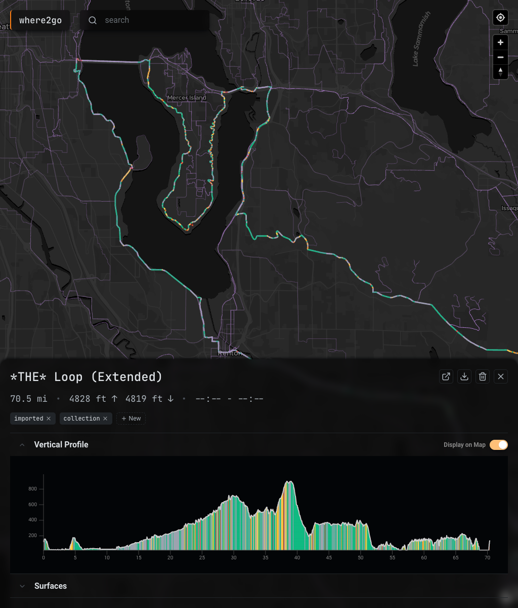
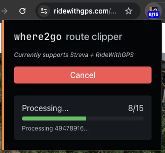

# where2go

A route aggregator/bookmarking app. Think of it as Pocket, but for routes.




If you’re anything like me, you’ve got a ton of routes saved on Strava,
RideWithGPS, and others, but come Saturday morning, you have no idea where to go
next. where2go centralizes everything into a single interactive map, helping you
visually explore your options.

Comprised of:

- An extension which lets you load routes from Strava and RideWithGPS
- A web app which allows browsing and managing routes on a single map. Mobile
  friendly, and WebGL-based.
- A backend which stores routes in a PostGIS database

Routes can be selected to see more details and be managed. You can also dow

## Quickstart

For now, where2go is self-hosted only.

Quick setup is possible with docker compose:

```bash
git clone https://github.com/cye/where2go.git
cd where2go
./scripts/generate-env.sh
docker compose up
```

Navigate to `http://localhost:5174` to view the app.

> [!NOTE]
> Modify the `.env` file and docker compose to connect to an existing Postgresql
> instance with PostGIS extension.

You'll also want to install the Chrome extension:

1. Open `chrome://extensions/`
2. Enable "Developer mode"
3. Click "Load unpacked"
4. Select the [`/extension`](./extension) directory
5. Click on the extension icon. On first run, an options tab will open. Set the
   where2go endpoint to your endpoint.
6. Navigate to a route or route collection page on Strava or RideWithGPS (you’ll
   probably have to be logged in). For example:
   https://ridewithgps.com/collections/2915253
7. Click the extension icon, and hit import. Routes will be imported and added
   to your where2go instance.

## Customizing Map Layers

The map supports configurable basemaps and overlay layers through JSON
configuration files.

### Basemaps

Basemap configurations are stored in
[`frontend/config/layers/basemaps/`](./frontend/config/layers/basemaps). They
utilize the
[MapLibre Style Specification](https://maplibre.org/maplibre-style-spec/), with
a few custom properties. Here is an example basemap configuration:

```json
{
  "id": "unique-basemap-id",
  "name": "Display Name",
  "url": "https://example.com/style.json"
}
```

**Custom Properties:**

- `id`: Unique identifier for the basemap
- `name`: Human-readable name shown in the layer selector
- `url`: Optional. URL to a remote MapLibre style JSON. Properties defined
  locally will override those from the remote style.
- `thumbnail`: Optional. URL to a thumbnail image. Supports {z}, {x}, {y} per
  the [TileJSON spec](https://github.com/mapbox/tilejson-spec/), which, if
  provided, are subsituted to a default tile location.

> [!NOTE]
> The app resolves thumbnails in the following order:
>
> 1. This `thumbnail` property, if provided.
> 2. A local image file with the same name as the config (e.g., `my-style.png`),
>    co-located with the config file.
> 3. If the style has a raster source, a thumbnail is auto-generated using a
>    default tile location.

All other properties follow the
[MapLibre Style Specification](https://maplibre.org/maplibre-style-spec/). You
can define a complete style inline or reference a remote style via `url`.

The app includes CartoDB Dark Matter as a free default basemap. To add a new
basemap, create a new JSON file in the basemaps directory. The basemap will
automatically appear in the layer selector.

Some example configs utilizing MapTiler are provided in
[`frontend/config/layers/basemaps/`](./frontend/config/layers/basemaps/).
MapTiler provides a free account with a small monthly limit. To use these
configs, you'll need to sign up for a MapTiler account and include your API key
in the style URL.

### Overlay Layers

Overlay configurations are stored in
[`frontend/config/layers/overlay/`](./frontend/config/layers/overlay). They also
use the MapLibre Style Specification. Here's an example style for a raster
overlay:

```json
{
  "order": 1,
  "id": "unique-overlay-id",
  "name": "Display Name",
  "version": 8,
  "sources": {
    "overlay-source": {
      "type": "raster",
      "tiles": ["https://example.com/tiles/{z}/{x}/{y}.png"],
      "tileSize": 256
    }
  },
  "layers": [
    {
      "id": "overlay-layer",
      "type": "raster",
      "source": "overlay-source",
      "paint": {
        "raster-opacity": 0.7
      }
    }
  ]
}
```

**Custom Properties:**

Overrlay layers support the same custom properties as basemaps, with the
addition of `order`

- `order`: Stacking order (lower numbers appear below higher numbers)

To add a new overlay, create a new JSON file in the overlay directory. The
overlay will automatically appear in the layer selector.

Some example configs utilize Strava Heatmap are provided in the
[`frontend/config/layers/overlay/*.example` files](./frontend/config/layers/overlay).
To use these configs, you'll need to set up a
[Strava Heatmap proxy service](https://github.com/chen-ye/strava-heatmap-proxy)
and add your API key to the configs.

## Dev Stuff

The project consists of three main components:

### Backend (`/backend`)

- **Runtime**: Deno
- **Framework**: Oak (HTTP server)
- **Database**: PostgreSQL with PostGIS extension
- **ORM**: Drizzle ORM
- **Features**:
  - RESTful API for route management
  - GPX parsing and GeoJSON conversion
  - Elevation statistics calculation
  - PostGIS spatial queries for route geometry

### Frontend (`/frontend`)

- **Framework**: React 19 with TypeScript
- **Build Tool**: Vite
- **Styling**: Open Props (CSS custom properties)
- **Map**: MapLibre GL with Deck.gl
- **Charts**: Visx for elevation profiles
- **UI Components**: Radix UI primitives
- **Features**:
  - Interactive map with route layer visualization
  - Elevation profile charts with tooltips
  - Route filtering and tagging
  - Responsive design

### Browser Extension (`/extension`)

- **Type**: Manifest V3 Chrome extension
- **Platforms**: Strava, RideWithGPS
- **Features**:
  - One-click route saving
  - Configurable endpoint settings
  - Custom HTTP headers support

### Development

#### Frontend Development

```bash
cd frontend
yarn install
yarn dev
```

The frontend will be available at `http://localhost:5174` with hot module
replacement.

#### Backend Development

The backend runs with `--watch` flag by default in Docker, so changes are
automatically reloaded.

To run locally without Docker:

```bash
cd backend
deno run --allow-net --allow-read --allow-env --watch main.ts
```

#### Code Quality

```bash
yarn check
```

## API Reference

### Endpoints

#### `GET /api/routes`

Get all routes with their metadata and geometry.

**Response:**

```json
[
  {
    "id": 1,
    "source_url": "https://www.strava.com/routes/123456",
    "title": "Morning Ride",
    "tags": ["training", "hills"],
    "created_at": "2024-01-01T10:00:00Z",
    "geojson": { "type": "LineString", "coordinates": [...] },
    "distance": 42195.5,
    "total_ascent": 450.2,
    "total_descent": 445.8
  }
]
```

#### `POST /api/routes`

Create or update a route.

**Request:**

```json
{
  "source_url": "https://www.strava.com/routes/123456",
  "title": "Morning Ride",
  "tags": ["training"],
  "gpx_content": "<gpx>...</gpx>"
}
```

#### `PUT /api/routes/:id`

Update route tags.

**Request:**

```json
{
  "tags": ["training", "hills", "favorite"]
}
```

#### `DELETE /api/routes/:id`

Delete a route.

#### `GET /api/routes/:id/download`

Download route as GPX file.

#### `POST /api/routes/:id/recompute`

Recompute elevation statistics for a specific route.

#### `POST /api/routes/recompute`

Recompute elevation statistics for all routes.

## Database Schema

### Routes Table

| Column          | Type      | Description                      |
| --------------- | --------- | -------------------------------- |
| `id`            | serial    | Primary key                      |
| `source_url`    | text      | Unique URL of the original route |
| `title`         | text      | Route name                       |
| `gpx_content`   | text      | Original GPX file content        |
| `tags`          | text[]    | Array of custom tags             |
| `created_at`    | timestamp | Creation timestamp               |
| `total_ascent`  | real      | Total elevation gain (meters)    |
| `total_descent` | real      | Total elevation loss (meters)    |
| `geom`          | geometry  | PostGIS LineString (SRID 4326)   |

## Notes

- This is a personal project! But happy to accept contributions—we should
  probably chat before you start working on anything (or just fork it). Hope
  it's useful to you as well.
- Yes, the stack is kind of weird. See above.
- Big disclaimer: much of this is co-written with one LLM or another. No
  promises on stability/safety, but _I’m_ using it.
